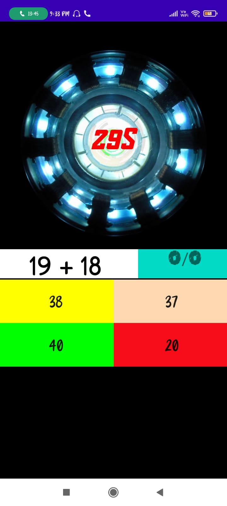
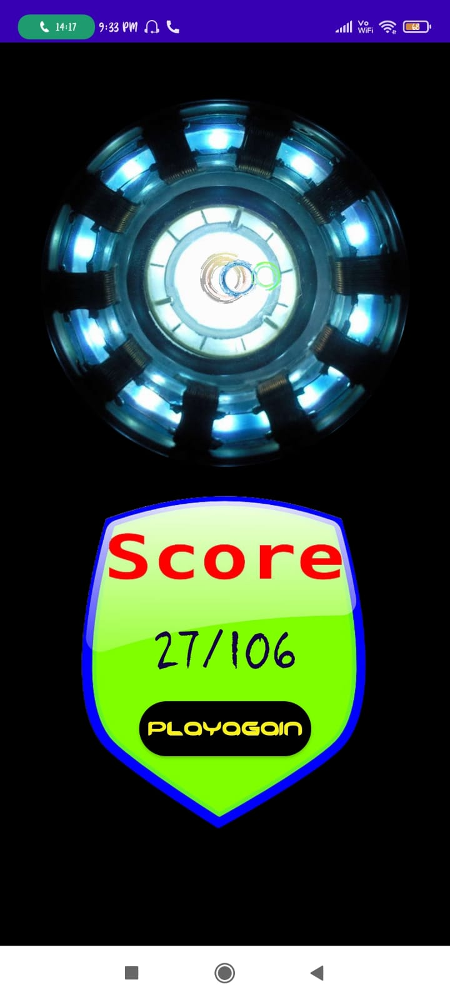
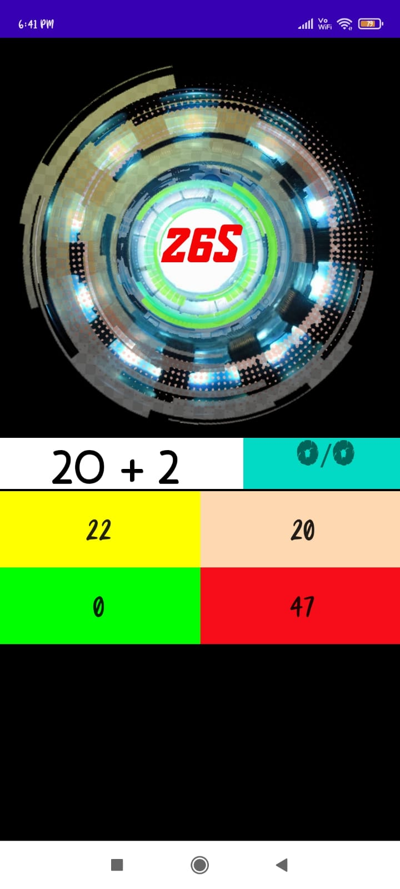
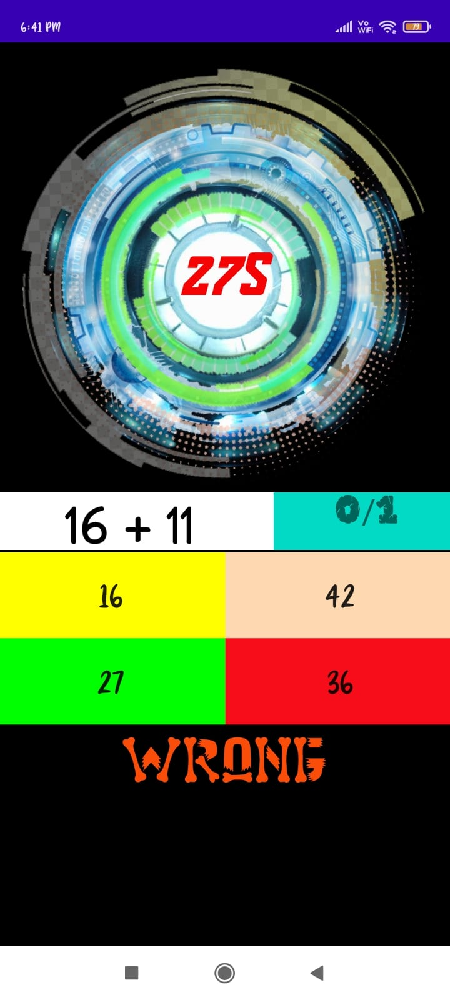

# Brain-Trainer-ANDROID-APP :star_struck: 

[](https://shields.io/) [](https://shields.io/) [](https://shields.io/) [](https://shields.io/) [](https://shields.io/) [](https://shields.io/) [](https://shields.io/) [](https://shields.io/) 

***This new android application named 'BRAIN-TRAINER-APP' is created by Biswarup Bhattacharjee, student of BTECH, in University of Engineering and Management, Kolkata.***

**Email Id: bbiswa471@gmail.com.** 

**Contact No: 916290272740.** 

<p align="left">
<a href="https://www.facebook.com/profile.php?id=100070395300810" target="blank"></a>
<a href="https://instagram.com/biswarup2210" target="blank"></a>
<a href="https://github.com/biswa2210/biswa2210" target="blank"></a>
</p>

## About :point_down: 

<div align="justified">
 
This Brain Trainer android application is created with java. Brain training games ask players to complete tasks that practice specific cognitive skills like memory, attention, logic, and quick thinking.Here if we open this app and start by clicking on the button 'GET STARTED', a mcq test will be started with questions of sums. Here we have to choose the correct answer among four questions. For 30 seconds this test wil continue then we will get the score out of no. of questions attended the no. of correct answers. This test is to check our speed and attentiveness. As much our score is as fast we can work. Here I have designed the app with an arc reacter which starts at the beginning of the test and stops at the end. We can start the test again by clicking on the button 'PLAY AGAIN'. This app is very easy to use and helpful to check our speed.

</div>

## APP DOWNLOAD LINK : :point_right: <a href="https://drive.google.com/file/d/1oWa9ZBfbnRb4JFa-2zTFMaAJbEsiVub9/view" download>Click here to download</a>

## Purpose :point_down:

<div align="justified">
       
I have made this brain trainer android application for people of any ages for checking their speed and attentiveness.
</div>
       
## Importance :point_down:

<div align="justified">

People of all ages use these games to improve mental functioning and prevent brain aging. Brain training may help improve your memory, response time, and logic skills, although research shows that the relationship between brain training games and improved cognitive function is complicated. Although brain games might not have the magical benefits you hoped for, they are not a total wash. Turns out, by playing a certain game over and over again, you are actually changing the way your brain works. “The benefits engendered by video game play are often the result of neuroplasticity, the ability of the brain to modify its structure, chemistry, and function in response to a challenge."
 
</div>

## Folder Structure :point_down:
```bash
brain-trainer-android-app
      └── app
           └── src
                └── main
                      └── java/com/example/braintrainer
                                     ├── MainActivity.java
                                     ├── gointent.java
                                     └── splashscreen.java   
 ```                      
## Making :point_down:

<div align="justified">

I have created main 3 java files to create this android app. I have created MainActivity.java, gointent.java, splashscreen.java and created some logics for implementation of this app. 

</div>


## Screenshots :point_down: 

<div align="center">
  
<a href="pics/bt1.jpeg"></a> <a href="pics/bt2.jpeg"></a> <a href="pics/bt3.jpeg"></a>
 
<a href="pics/bt4.jpeg"></a> <a href="pics/bt5.jpeg"></a> <a href="pics/bt6.jpeg"></a>
       
</div>


